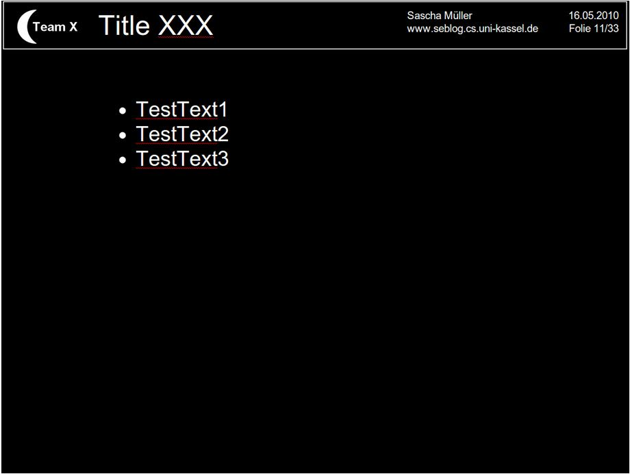

= Folien- und PPT-Tipps
Wie baut man eine Folie auf? Aus eigener Erfahrung kann ich sagen, dass zu viele Punkte eine Folie überladen. Ein paar kurze Stichworte, die vom Redner passend erklärt, ergänzt und in einen Satz verpackt werden sind 1000x besser, als ausgeschriebene Sätze. Das veranlasst nämlich zum “Vorlesen”, d.h. der Redner liest ab und der Zuhörer liest mit (und ist meist schneller als der Redner). Außerdem sind “No-Go’s”:

* Riesige Header (bitte maximal Schriftgröße 36)
* Große Logos (ein normal großes am Anfang und am Ende sollte reichen)
* Bunte Footer (braucht kein Mensch)
* Wasserzeichen als Hintergrund (macht die Folie nur unübersichtlich und unleserlich)
* Zu viel Text (kurze Stichworte, aber keine Aufzählungen)
* zu viele Animationen und Clipart (Clipart ist ganz schlecht!, zu viele Animationen lenken ab)

Die Folie/n sollte/n generell euren Namen enthalten, eine Foliennummer und evtl. euren Teamnamen (Gruppennamen! z.B. “Team C”).
Hier ein kleines Beispiel, wie eine Folie aussehen könnte:

Wie immer gilt: Das ist keine Vorgabe, sondern nur eine Hilfestellung. Ihr solltet aber darauf achten, dass das Foliendesign zu eurer Gruppe/ eurem Unternehmen passt. Solltet ihr zum Beispiel eine Designfirma haben, dann wäre das obige Design nicht sonderlich geeignet. ;-)

